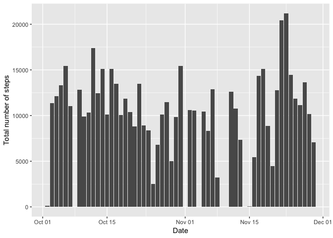
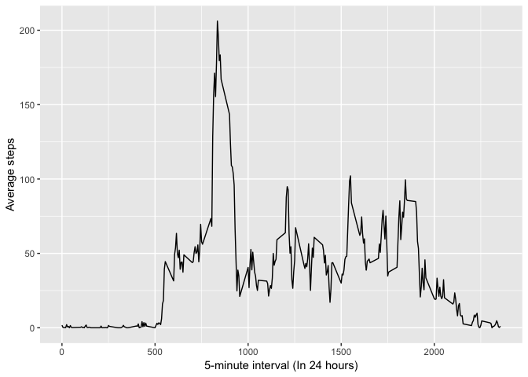
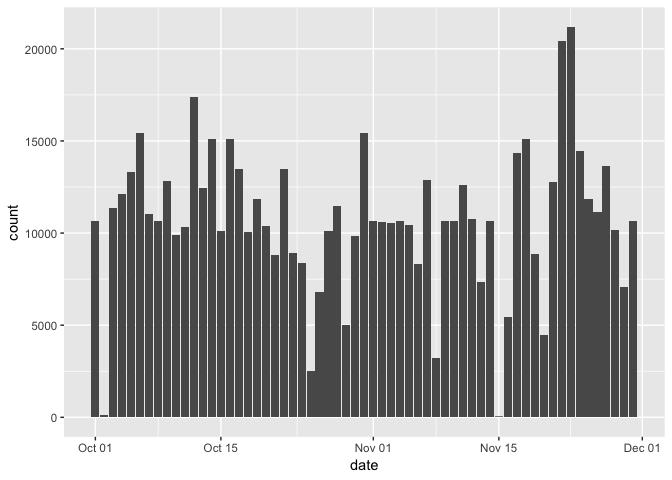
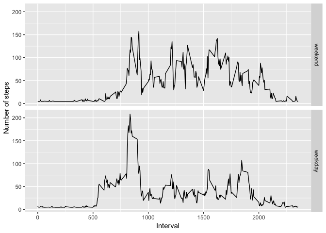

## Load libraries


```r
library(dplyr)
```

```
## 
## Attaching package: 'dplyr'
```

```
## The following objects are masked from 'package:stats':
## 
##     filter, lag
```

```
## The following objects are masked from 'package:base':
## 
##     intersect, setdiff, setequal, union
```

```r
library(ggplot2)
library(data.table)
```

```
## 
## Attaching package: 'data.table'
```

```
## The following objects are masked from 'package:dplyr':
## 
##     between, first, last
```


## Loading and preprocessing the data


#### 1. Load the data

```r
activity <- read.csv("activity.csv")
```


#### 2. Process/transform the data (if necessary) into a format suitable for your analysis
Explore the data

```r
str(activity)
```

```
## 'data.frame':	17568 obs. of  3 variables:
##  $ steps   : int  NA NA NA NA NA NA NA NA NA NA ...
##  $ date    : Factor w/ 61 levels "2012-10-01","2012-10-02",..: 1 1 1 1 1 1 1 1 1 1 ...
##  $ interval: int  0 5 10 15 20 25 30 35 40 45 ...
```

There are **17568** observations and **3** columns and it looks like **steps** column have a lot of missing values (NA)


```r
sum(!is.na(activity$steps))
```

```
## [1] 15264
```
Around **13%** of the data seems to be missing so filter out rows with missing values 

```r
activity_na_filtered <- activity[!is.na(activity$steps), ]
```

Change the data type of date from Factor to Date

```r
activity_na_filtered$date <- as.Date(activity_na_filtered$date)
```

## What is mean total number of steps taken per day?

#### 1. Calculate the total number of steps taken per day

```r
total_steps_per_day <-  activity_na_filtered %>% 
  mutate(date = as.Date(date)) %>%
  group_by(date) %>% 
  summarize(total_steps = sum(steps))
print(total_steps_per_day)
```

```
## # A tibble: 53 x 2
##    date       total_steps
##    <date>           <int>
##  1 2012-10-02         126
##  2 2012-10-03       11352
##  3 2012-10-04       12116
##  4 2012-10-05       13294
##  5 2012-10-06       15420
##  6 2012-10-07       11015
##  7 2012-10-09       12811
##  8 2012-10-10        9900
##  9 2012-10-11       10304
## 10 2012-10-12       17382
## # ... with 43 more rows
```

#### 2. Make a histogram of the total number of steps taken each day
Calculate continous frequency distribution of steps taken per day

```r
activity_fd <- 
  activity_na_filtered[rep(1:nrow(activity_na_filtered), 
                           activity_na_filtered[,1]),-1]
```

Plot a histogram based on calculated frequency distribution

```r
ggplot(activity_fd, aes(date)) + 
  geom_histogram(stat = "count") +
  labs(x = "Date", y = "Total number of steps")
```

```
## Warning: Ignoring unknown parameters: binwidth, bins, pad
```

<!-- -->

#### 3. Calculate and report the mean and median of the total number of steps taken per day

```r
mean_steps <- round(mean(total_steps_per_day$total_steps), 0)
median_steps <- round(median(total_steps_per_day$total_steps), 0)
```
The mean and meadian for the total number of steps taken per day is **10766**  and **10765** respectively

## What is the average daily activity pattern?

#### 1. Make a time series plot (i.e. type="l") of the 5-minute interval (x-axis) and the average number of steps taken, averaged across all days (y-axis)

```r
average_across_days <- activity_na_filtered %>% 
  group_by(interval) %>% 
  summarize(mean_steps = mean(steps))

ggplot(average_across_days, aes(interval, mean_steps)) + 
  geom_line() + 
  labs(x = "5-minute interval (In 24 hours)", y = "Average steps")
```

<!-- -->

### 2. Which 5-minute interval, on average across all the days in the dataset, contains the maximum number of steps?

```r
max_steps_interval <- average_across_days %>% 
  filter(mean_steps == max(mean_steps))
```
The average maximum number of steps of **206** is at interval **835** across all the days in the dataset

## Imputing missing values

#### 1. Calculate and report the total number of missing values in the dataset (i.e. the total number of rows with NAs)


```r
total_NA <- sum(is.na(activity$steps))
percentage_of_NA <- round(mean(is.na(activity$steps)) * 100, 2)
```
There are **2304** number of missing values that are around **13.11%** of the entire dataset

#### 2. Devise a strategy for filling in all of the missing values in the dataset.

Use `tapply` to calculate average steps across interval throughout all days

```r
average_across_interval <- 
  tapply(activity$steps, activity$date, mean, na.rm = TRUE)
head(average_across_interval)
```

```
## 2012-10-01 2012-10-02 2012-10-03 2012-10-04 2012-10-05 2012-10-06 
##        NaN    0.43750   39.41667   42.06944   46.15972   53.54167
```

There are still some `NaN` in the result, it's due to the fact that there are no data throughout that day so take average over entire non missing values and replace the missing values with that average

```r
average_without_nan <- mean(average_across_interval, na.rm = TRUE)
average_across_interval <- ifelse(is.nan(average_across_interval), 
                                  round(average_without_nan, 0), 
                                  round(average_across_interval, 0))
```

Get dates of the interval where there are missing values

```r
na_dates <- activity$date[which(is.na(activity$steps))]
```
Replace the missing values with the average values estimated for that day, it is done in the next step

#### 3. Create a new dataset that is equal to the original dataset but with the missing data filled in.


```r
activity_na_replaced <- copy(activity)

activity_na_replaced[is.na(activity_na_replaced)] <- 
  average_across_interval[na_dates]
```

Change the data type of date from Factor to Date

```r
activity_na_replaced$date <- as.Date(activity_na_replaced$date)
```

#### 4. Make a histogram of the total number of steps taken each day and Calculate and report the mean and median total number of steps taken per day. Do these values differ from the estimates from the first part of the assignment? What is the impact of imputing missing data on the estimates of the total daily number of steps?

Total number of steps taken per day

```r
total_steps_per_day_na_replaced <-  activity_na_replaced %>% 
  mutate(date = as.Date(date)) %>%
  group_by(date) %>% 
  summarize(total_steps = sum(steps))
print(total_steps_per_day)
```

```
## # A tibble: 53 x 2
##    date       total_steps
##    <date>           <int>
##  1 2012-10-02         126
##  2 2012-10-03       11352
##  3 2012-10-04       12116
##  4 2012-10-05       13294
##  5 2012-10-06       15420
##  6 2012-10-07       11015
##  7 2012-10-09       12811
##  8 2012-10-10        9900
##  9 2012-10-11       10304
## 10 2012-10-12       17382
## # ... with 43 more rows
```

Calculate continous frequency distribution of steps taken per day

```r
activity_na_replaced_fd <- 
  activity_na_replaced[rep(1:nrow(activity_na_replaced), 
                           activity_na_replaced[,1]),-1]
```

Plot a histogram based on calculated frequency distribution

```r
ggplot(activity_na_replaced_fd, aes(date)) + 
  geom_histogram(stat = "count") +
  labs(x = "Date", y = "Total number of steps")
```

```
## Warning: Ignoring unknown parameters: binwidth, bins, pad
```

<!-- -->

Calculate and report the mean and median of the total number of steps taken per day

```r
mean_steps_na_replaced <- mean(total_steps_per_day_na_replaced$total_steps)
median_steps_na_replaced <- median(total_steps_per_day_na_replaced$total_steps)
```
The mean and meadian for the total number of steps taken per day is **10751.74**  and **10656** respectively


```r
mean_difference <- round(abs(mean_steps_na_replaced - mean_steps), 0)
median_difference <- round(abs(median_steps_na_replaced - median_steps), 0)
```
From the first part of the assignment the mean differ with **14** steps and median differ with **109** steps. We can infer that there's no big impact on imputing missing data.

## Are there differences in activity patterns between weekdays and weekends?

#### 1. Create a new factor variable in the dataset with two levels – “weekday” and “weekend” indicating whether a given date is a weekday or weekend day.


```r
weekends <- c("Saturday","Sunday")

activity_na_replaced <- activity_na_replaced %>% 
  mutate(day_of_week = 
           factor(ifelse(weekdays(date) %in% weekends, "weekend", "weekday"), 
                  levels = c("weekend","weekday")))
```


#### 2. Make a panel plot containing a time series plot (i.e. type="l") of the 5-minute interval (x-axis) and the average number of steps taken, averaged across all weekday days or weekend days (y-axis). See the README file in the GitHub repository to see an example of what this plot should look like using simulated data.

```r
average_across_week <- activity_na_replaced %>% 
  group_by(day_of_week, interval) %>% 
  summarize(mean_steps = mean(steps))

ggplot(average_across_week, aes(interval, mean_steps)) + 
  geom_line() + 
  facet_grid(rows = vars(day_of_week)) +
  labs(x = "Interval", y = "Number of steps")
```

<!-- -->
